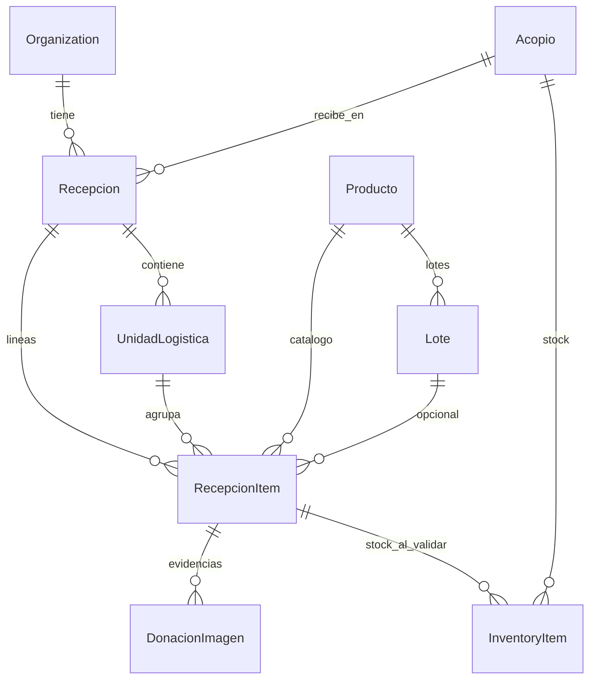

# Recepción — dominio

Rediseño del recibo **sin tirar** `productos` ni `inventory_items`. La foto deja de crear stock: identifica producto dentro de una recepción.

Español (fuente de verdad). English summary at the end.

## Qué está mezclado hoy

| Tabla | Dice que es | En la práctica |
| --- | --- | --- |
| `productos` | Catálogo (“qué es”) | Bien. Le falta SKU, reglas (lote/vencimiento) y no se crea solo desde la IA |
| `inventory_items` | Existencia en un acopio | Recepción + lote + donante + ubicación + presentación + talla + estado + cantidad |
| `donacion_imagenes` | Foto de un envase | Al confirmar **escribe inventario**. Eso es “llegó una caja” bien; no escala a un camión |

Un operador de campo con una bolsa no puede tener el mismo formulario que un camión de 18 pallets. El evento de llegada tiene que existir **antes** de las líneas.

`inventory_items` **no se borra**. Deja de ser la puerta de entrada. Pasa a ser **stock post-validación** (lo que se puede reservar / pickear).

## Principios

1. **Recepción = evento físico.** No es un producto ni una foto.
2. **La foto identifica; no registra el camión.** EAN → catálogo → OFF → visión → confirmar → si no existe, **alta en `productos`**.
3. **Códigos humanos los genera el sistema** (`REC-…`, `PAL-…`, `LOT-…`, SKU). El UUID sigue siendo la PK.
4. **Lote y vencimiento pueden faltar.** Se recibe igual; el catálogo decide si es alerta o bloqueo al validar.
5. **Cantidades partidas, no un solo `estado`.** 100 recibidas ≠ 100 dañadas.
6. **Pallet recibido ≠ pallet de despacho.** `unidad_logistica` en recepción es contenedor que **llegó**. El pallet de picking es otro ciclo.
7. **Sin redundancia de catálogo.** Un EAN o un (nombre canónico + marca + presentación) = un `producto`.

## Entidades (v1 — solo recepción)



### 1. `productos` (se queda, se extiende)

Sigue siendo el catálogo maestro **global** (el arroz Diana es el mismo en todos los acopios).

| Campo | Notas |
| --- | --- |
| `id` | UUID |
| `sku` | Único, generado (`ARZ-0001`). El operador puede corregirlo |
| `nombre` | Canónico, corto |
| `marca` | nullable |
| `categoria` | Reusar `InventoryCategoria` |
| `ean` | único si existe |
| `alias[]` | para emparejar OCR/visión |
| `unidad_base` | `UNIDAD`, `KILO`, … |
| `presentacion` | texto libre v1 (`1 kg`). Variantes (talla / gramaje) = fase 2 |
| `requiere_lote` | default según categoría (alimentos/medicamentos: true) |
| `requiere_vencimiento` | igual |
| `es_perecedero` | |
| `is_active` | baja lógica |

Alta desde IA: ver [Emparejar y crear producto](#emparejar-y-crear-producto).

### 2. `recepciones`

Un camión, una donación individual o una transferencia = **una** fila.

| Campo | Notas |
| --- | --- |
| `id` | UUID |
| `codigo` | `REC-2026-000182` (por org + año, automático) |
| `organization_id` | |
| `acopio_id` | dónde llega |
| `tipo` | `DONACION_INDIVIDUAL` \| `DONACION_MASIVA` \| `TRANSFERENCIA` \| `COMPRA` \| `DEVOLUCION` \| `REUBICACION` \| `OTRO` |
| `presentacion_fisica` | `SUELTA` \| `CAJAS` \| `BULTOS` \| `PALLETS` \| `CONTENEDORES` \| `MIXTA` |
| `estado` | `BORRADOR` → `EN_RECEPCION` → `EN_INSPECCION` → `PENDIENTE_VALIDACION` → `VALIDADA` \| `CERRADA` \| `ANULADA` |
| `recibida_en` | fecha/hora |
| `donante_nombre` / `donante_contacto` | v1 texto; tabla Donante después |
| `procedencia` | |
| `transportista` | |
| `vehiculo_placa` | |
| `documento_transporte` | |
| `observaciones` | |
| `responsable_id` | usuario que abre |
| `is_active` | |

### 3. `unidades_logisticas`

Contenedor **recibido** (no de despacho).

| Campo | Notas |
| --- | --- |
| `id` | UUID |
| `codigo` | `PAL-000018` por organización, automático |
| `nro_en_recepcion` | 1…N para “pallet 3 de este camión” |
| `recepcion_id` | |
| `tipo` | `PALLET` \| `CAJA` \| `BULTO` \| `SACO` \| `CONTENEDOR` \| `CANECA` \| `BOLSA` \| `PAQUETE` \| `OTRO` |
| `parent_id` | nullable. Caja dentro de pallet |
| `estado` | `RECIBIDA` \| `ABIERTA` \| `VACIA` (desmontaje posterior) |
| `observaciones` | humedad, daños de empaque |

Si la mercancía viene **suelta**, la recepción puede no crear ULs: el ítem cuelga directo de la recepción (`unidad_logistica_id` null).

### 4. `lotes`

Existencia de un producto con (opcional) código de origen y vencimiento.

| Campo | Notas |
| --- | --- |
| `id` | UUID |
| `codigo` | `LOT-2026-000821` automático **siempre** |
| `codigo_origen` | el del donante, si lo trajo; si no, null + alerta |
| `producto_id` | |
| `vencimiento` | nullable |
| `organization_id` | el lote es de quien recibió |

No se bloquea la línea si falta origen o vencimiento. Al **validar**, si `producto.requiere_*` y falta dato: no pasa a disponible (cuarentena o pendiente).

### 5. `recepcion_items`

La línea de trabajo. Acá vive cantidad, inspección y el vínculo a foto/producto/lote/UL.

| Campo | Notas |
| --- | --- |
| `id` | UUID |
| `recepcion_id` | |
| `unidad_logistica_id` | nullable |
| `producto_id` | tras confirmar identificación |
| `lote_id` | nullable |
| `cantidad_recibida` | lo que bajó del camión |
| `cantidad_aprobada` | inspección |
| `cantidad_cuarentena` | |
| `cantidad_rechazada` | |
| `unidad` | debe coincidir con `producto.unidad_base` o convertirse después |
| `peso_kg` | nullable |
| `estado_linea` | `PENDIENTE_ID` \| `IDENTIFICADA` \| `INSPECCIONADA` \| `VALIDADA` |
| `observaciones` | “10 cajas con humedad” |

Invariante: `recibida = aprobada + cuarentena + rechazada` cuando la línea está inspeccionada (pendiente: solo `recibida`).

### 6. `donacion_imagenes` (se queda, cambia el rol)

Sigue en R2. Pasa a ser **evidencia + ayuda de ID** de un `recepcion_item` (FK nueva `recepcion_item_id`).

Deja de llamar a “confirmar → crear `inventory_item`” como único camino. Confirmar = resolver `producto_id` (y opcionalmente cantidad sugerida).

### 7. `inventory_items` (se queda, se estrecha después)

Hoy no se migra ni se borra. **Después de VALIDAR** una recepción, el sistema **posta** stock:

- una fila (o incremento) por `(acopio, producto, lote, estado_calidad)`
- `cantidad` = `cantidad_aprobada`
- cuarentena / rechazo **no** entran a disponible

Campos de donante, presentación y talla en inventario dejan de ser la fuente: quedan denormalizados un tiempo o se ignoran en altas nuevas.

`ubicacion_interna` sigue texto en v1. Tabla de ubicaciones = fase posterior (reserva/picking).

## Códigos automáticos

Tabla `org_counters`: `(organization_id, kind, periodo)` → `siguiente`.

| Kind | Formato | Alcance |
| --- | --- | --- |
| `RECEPCION` | `REC-{YYYY}-{n:6}` | org + año |
| `UNIDAD_LOGISTICA` | `{PAL\|CAJ\|BUL\|…}-{n:6}` | org (único en el tiempo) |
| `LOTE` | `LOT-{YYYY}-{n:6}` | org + año |
| `PRODUCTO_SKU` | `{prefijo catálogo}-{n:4}` | global (catálogo único) |

`nro_en_recepcion` es 1, 2, 3… **dentro de esa recepción** (el operador ve PAL-001 en pantalla; en BD también está `PAL-000018`).

Nadie tipea estos códigos. El donante puede traer *su* lote: va a `codigo_origen`.

## Emparejar y crear producto

Orden, siempre el mismo, para no duplicar:

1. **EAN** leído en la foto (máxima resolución, como ahora) → `productos.ean`.
2. Si no, **Open Food Facts** → si hay match, **crear o actualizar** `productos` (ean, nombre, marca) y seguir.
3. Si no, **visión** → nombre/marca/cantidad.
4. Buscar en catálogo: EAN; si no, nombre+marca normalizados (la fusión que ya existe para inventario).
5. El operador ve: “¿Es Arroz Diana 1 kg?” **Sí / Cambiar / No está**.
6. **No está** → `INSERT productos` con lo de la IA (nombre, marca, ean si vino, categoría inferida o `OTRO`, `unidad_base` default `UNIDAD`, `sku` generado, reglas de lote según categoría). El operador puede editar antes de guardar.
7. Alias: se agregan términos detectados para la próxima.

Nunca dos filas con el mismo EAN. Nunca crear producto en silencio: el operador confirma el alta.

## Flujo de pantallas (un solo modelo, distinta profundidad)

```
BORRADOR
  crear recepción (acopio, tipo, donante, placa…)
EN_RECEPCION
  ¿cómo llegó? → generar N unidades logísticas (opcional)
  por UL o suelta: Foto en el pallet/caja, o el selector al confirmar → producto → cantidad → lote
EN_INSPECCION
  partir cantidades (aprobada / cuarentena / rechazada)
  evidencias (más fotos)
PENDIENTE_VALIDACION
  cierre de líneas
VALIDADA
  postear stock aprobado a inventory_items
CERRADA
  inmutable salvo anulación lógica
```

Una donación de una caja: tipo `DONACION_INDIVIDUAL`, presentación `SUELTA` o `CAJA`, **una** UL o ninguna, **una** línea, foto como ahora. No se obliga a cargar 18 pallets.

## Tres casos

### A — Donación individual (una caja de arroz)

1. Nueva recepción → tipo individual, acopio Bogotá, donante “Vecino”.
2. Presentación: caja (o suelta). Sistema crea `CAJ-000041` o ningún UL.
3. Foto del envase → EAN o visión → “Arroz Diana 1 kg”. Si no está en `productos`, se crea `ARZ-0007`.
4. Cantidad 20 UND. Lote desconocido → `LOT-2026-000012` interno, `codigo_origen` null, alerta.
5. Inspección: 20 aprobadas.
6. Validar → `inventory_items` += 20 en ese acopio / producto / lote.

Misma foto de hoy; cambia el *dónde* se guarda el resultado.

### B — Camión, 18 pallets, 42 productos, 7 lotes, 3 con daños

1. Recepción masiva, placa ABC123, `presentacion_fisica = PALLETS`, cantidad de pallets = 18.
2. Sistema crea `PAL-000101` … `PAL-000118` (`nro_en_recepcion` 1…18).
3. Operador toca **Foto** en PAL-001 (o elige la unidad al confirmar la foto), EAN/visión de cada SKU distinto, cantidades, lotes (origen o generado).
4. PAL-004: 100 cajas, 90 / 7 / 3 en la línea (no `estado = dañado` sobre 100).
5. Validar: solo aprobadas a stock; cuarentena queda trazable en la línea; rechazadas no pickeables.

### C — Donación masiva sin registrar detalle (llegó y no hay tiempo)

1. Se **abre** la recepción (evento + acopio + “camión, ~18 pallets”).
2. Se generan las 18 UL vacías (o ni eso: solo cabecera).
3. Estado `EN_RECEPCION`. Stock **no** aumenta.
4. Otro turno identifica productos por pallet. El código `REC-2026-000182` ya existe; no se pierde el camión.

Si no hay ni cabecera, no hay trazabilidad. El mínimo viable profesional es **abrir la recepción**.

## Qué no hacemos en esta oleada

- `producto_variante` (tallas / 500 g vs 1 kg como SKU hijo).
- Ubicación tipo `BOD01-P02-R04` como entidad.
- Pallet de **despacho** / kits.
- Borrar `inventory_items` ni migrar histórico a la fuerza (las filas viejas siguen siendo stock).
- Obligar lote en alimentos en el primer commit: regla en catálogo + alerta; bloqueo al validar se puede prender por categoría después.

## Orden de implementación (cuando pases a código)

1. Extender `productos` (sku, reglas) + contador de SKU + alta al confirmar visión si no existe.
2. `recepciones` + `unidades_logisticas` + `lotes` + `recepcion_items` + contadores.
3. Colgar `donacion_imagenes` de `recepcion_item`; confirmar foto **no** posta inventario.
4. Validar recepción → incrementar `inventory_items`.
5. UI: donación individual (paridad con “Registrar producto”) y después masiva (pallets). **Hecho en esta oleada.**

---

## English

Reception becomes its own event (`recepciones`) with optional logistic units (`PAL-…` auto), lines, lots (`LOT-…` auto), and photos as ID/evidence. A photo must be assigned to a unit (or marked loose) before confirm. `productos` stays the catalog: if vision/EAN finds nothing, the operator confirms a new row (no silent dupes). `inventory_items` is kept and only increases after validation (approved qty). One model covers a single box, an 18-pallet truck, and “log the truck now, count later”.
